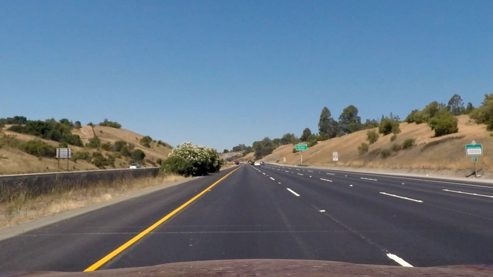

### LaneDetectPro: An Advanced Lane Finding Python Package

The component of this package are the following:

* Compute the camera calibration matrix and distortion coefficients given a set of chessboard images.
* Apply a distortion correction to raw images.
* Use color transforms, gradients, etc., to create a thresholded binary image.
* Apply a perspective transform to rectify binary image ("birds-eye view").
* Detect lane pixels and fit to find the lane boundary.
* Determine the curvature of the lane and vehicle position with respect to center.
* Warp the detected lane boundaries back onto the original image.
* Output visual display of the lane boundaries and numerical estimation of lane curvature and vehicle position.

[//]: # (Image References)

[image1]: ./camera_cal/calibration1.jpg "Undistorted"
[image11]: ./calibration_result/calibration1.jpg "Undistorted"
[image2]: ./test_images/test1.jpg "Road Transformed"
[image3]: ./examples/binary_combo_example.jpg "Binary Example"
[image4]: ./examples/warped_straight_lines.jpg "Warp Example"
[image5]: ./examples/color_fit_lines.jpg "Fit Visual"
[image6]: ./examples/example_output.jpg "Output"
[video1]: ./project_video.mp4 "Video"


### Camera Calibration


The code for this step is contained in the second code cell of the IPython notebook located in "./LaneDetectPro.ipynb".  

First, the "object points" are prepated, which will be the (x, y, z) coordinates of the chessboard corners in the world. It is assumed that the  chessboard is fixed on the (x, y) plane at z=0, such that the object points are the same for each calibration image.  Thus, `objp` is just a replicated array of coordinates, and `objpoints` will be appended with a copy of it every time I successfully detect all chessboard corners in a test image.  `imgpoints` will be appended with the (x, y) pixel position of each of the corners in the image plane with each successful chessboard detection.  

Then the output `objpoints` and `imgpoints` are used to compute the camera calibration and distortion coefficients using the `cv2.calibrateCamera()` function.  

I applied this distortion correction to the test image using the `cv2.undistort()` function and obtained this result:


 

Undistorted images are saved in the `./calibration_result/` folder.


### Pipeline (single images)

#### 1. An example of a distortion-corrected image.

Using the same calibration parameters computed in last step, in this step one of the lane driving example images is  undistorted:

```python
input_image = mpimg.imread('test_images/straight_lines1.jpg')
undistorted_image = cv2.undistort(input_image, mtx, dist, None, mtx)
mpimg.imsave('calibration_result/straight_lines1.jpg',undistorted_image)
```





#### 2. Creating thresholded binary image by color transforms and gradients

A combination of color and gradient thresholds is used to generate a binary image (thresholding steps in the 4th code cell of the `LaneDetectPro.ipynb`").  Here's an example of my output for this step, for the undistorted version of the `straight_lines1.jpg` image:


The function to create the thresholded binary image is `col_trans_grad()` with the default threshold values shown bellow:

```python
 col_trans_grad(img, s_thresh=(170, 255), sx_thresh=(20, 100))
```
Two other resulting images of the thresholded binary image function are shown bellow


#### 3. Perspective transform

The coordinates for the source and destination points for perspective transform are called `src_points` and `dst_points`.

First four points are selected from the `straight_lines1.jpg`, as bellow:


The pixel coordinates of these points are as bellow:

```python
src_points = np.float32([[265, 680], [1048, 680],
                [622, 435], [658, 435]])
```

To determine the `dst_points`, I used two prior knowledge about the highway,
first, the lane width is 3.7 meter and the longitudinal distance between lanes are about 9 meter. Therefore if the selected rectangle is 3.7m x 30 m, in pixel coordinate system, if width is 700 then the height should be 8*700 = 5600 pixel:

```python
centre= (265+1048)/2
offset = 700
dst_points = np.float32([[centre-offset/2, 680], [centre+offset/2, 680],
                  [centre-offset/2, 680-8*offset], [centre+offset/2, 680-8*offset]])

```


This resulted in the following source and destination points:


| Source        | Destination   |
|:-------------:|:-------------:|
| 265, 680      | 306, 680       |
| 1048, 680      | 1006.5, 680      |
| 622, 435     | 306.5, -4920      |
| 658, 435      | 1006.5, -4920        |


Here, some Transformed images are shown:

```python
M = cv2.getPerspectiveTransform(src_points, dst_points)
```


#### 4.Identify lane-line pixels and fit their positions with a polynomial

The line detection is done in cell #11-#12, functions ` find_lane_pixels(binary_warped)`, `fit_poly(binary_warped_shape,leftx, lefty, rightx, righty)` and `search_around_poly(binary_warped,left_fit,right_fit)`


#### 5. Calculating the radius of curvature of the lane and the position of the vehicle with respect to center.

 This in done in cell 13 in the notebook, via function `fit_polynomial_accutal(binary_warped)`


#### 6. Image of the result plotted back down onto the road

Function `process_image(input_image)` in cell #14 get the input image and then do all computations on it and then write the outcomes back again on the input image.


---

### Pipeline (video)

#### 1. Final video output.

Here's a [link to my video result](./project_video_out.mp4)

---
